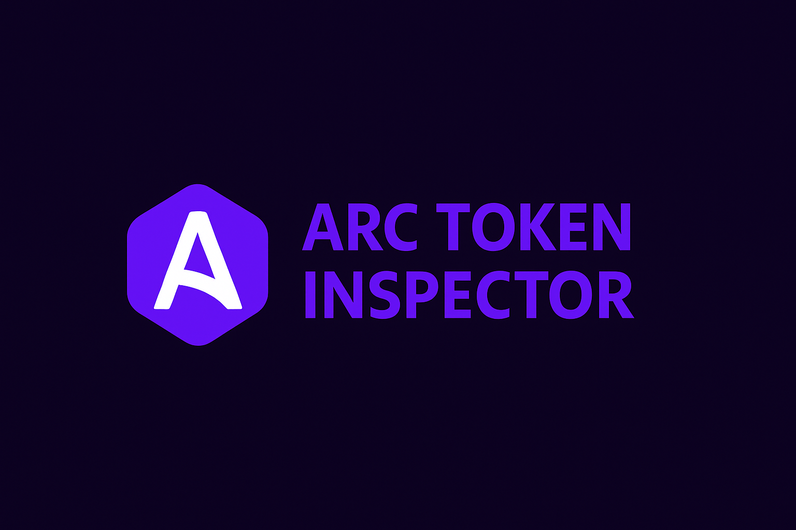

<!-- Banner -->
<p align="center">
  
</p>

<h1 align="center">🔍 ARC Token Inspector</h1>

<p align="center">
  A fast and intuitive tool for inspecting ERC-20 tokens on the Arc Testnet.
</p>

<p align="center">
  
  
  
</p>

---

## 🚀 Overview

**ARC Token Inspector** is a lightweight and efficient tool designed to validate and analyze ERC-20 tokens deployed on the Arc Testnet.

With a single contract address, you can instantly view:

- Token name  
- Symbol  
- Decimals  
- Total supply  
- Contract validation  
- Clean and responsive UI feedback  

Built for developers, testers, and explorers working inside the Arc ecosystem.

---

## ✨ Features

- 🧪 **Instant ERC-20 contract validation**  
- 🪙 **Complete token metadata retrieval**
- ⚡ **Fast execution powered by Arc RPC**
- 🎨 **Modern UI consistent with Arc dApps**
- 📱 **Fully responsive mobile experience**
- 🔥 **Smooth animations and interactive feedback**
- 👨‍💻 **Lightweight, readable, and extensible code**

---

## 🌐 Live Demo & Repository

### 🔗 **Live App**
https://arc-token-inspector.vercel.app/

### 📦 **GitHub Repository**
https://github.com/joaodd1590-sys/Arc-Token-Inspector

---

## 🛠️ Tech Stack

| Technology | Purpose |
|-----------|----------|
| **HTML** | App structure |
| **CSS** | Styling, theming & responsiveness |
| **JavaScript** | Core logic & RPC interaction |
| **Arc Testnet RPC** | Contract and metadata queries |
| **Vercel** | Hosting & deployment |

---

## 📥 Local Installation

Clone the repository:

```bash
git clone https://github.com/joaodd1590-sys/Arc-Token-Inspector
cd Arc-Token-Inspector
